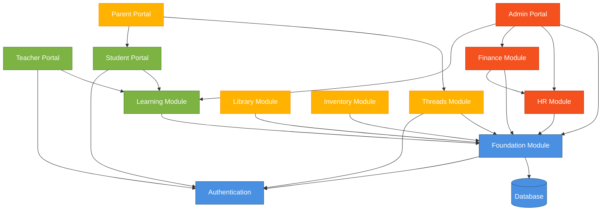
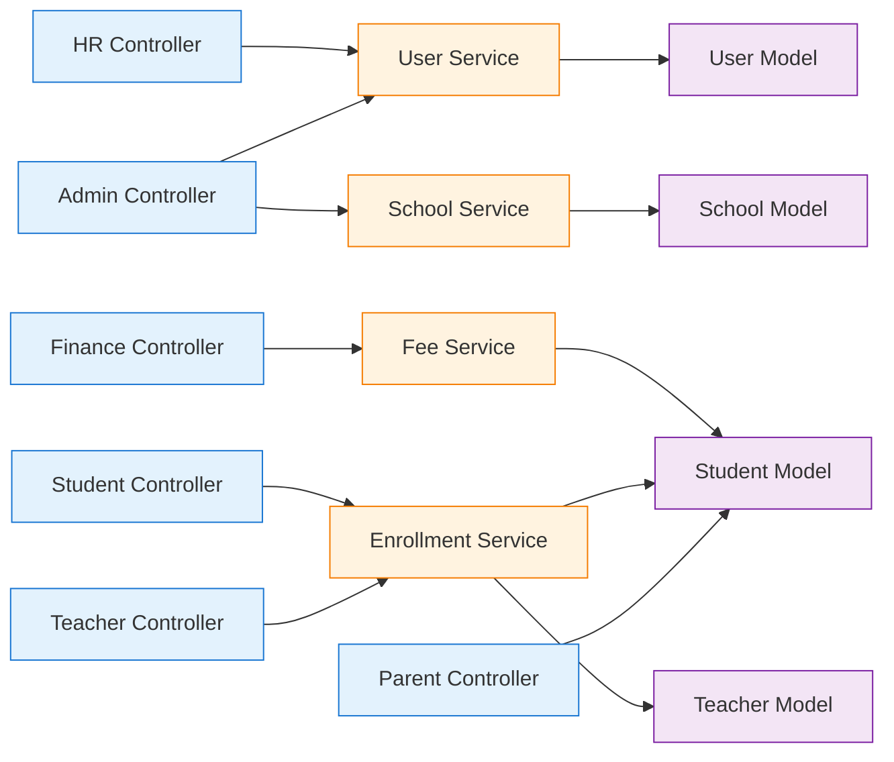
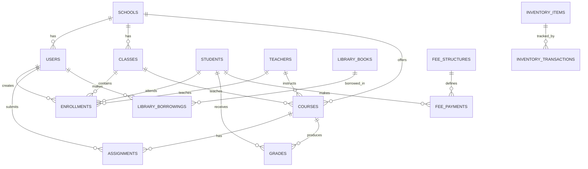
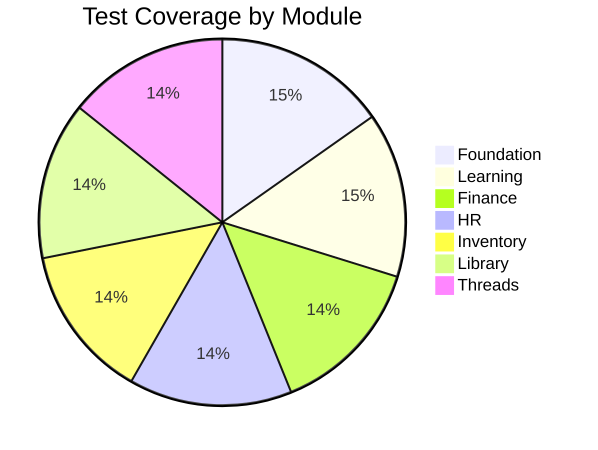

# ShuleLabs CI4 Dependency Graph

Generated: 2025-11-23 15:23:58

## Module Dependencies

## Controller Dependencies

## Database Schema Relationships

## API Routes Map

```mermaid
graph TD
    API["/api"]
    
    API --> Auth["/auth"]
    API --> Admin["/admin"]
    API --> Teacher["/teacher"]
    API --> Student["/student"]
    API --> Parent["/parent"]
    API --> Finance["/finance"]
    
    Auth --> Login["/login"]
    Auth --> Logout["/logout"]
    Auth --> Register["/register"]
    
    Admin --> AdminDash["/dashboard"]
    Admin --> AdminUsers["/users"]
    Admin --> AdminSchools["/schools"]
    
    Teacher --> TeacherDash["/dashboard"]
    Teacher --> TeacherCourses["/courses"]
    Teacher --> TeacherGrades["/grades"]
    
    Student --> StudentDash["/dashboard"]
    Student --> StudentEnroll["/enrollments"]
    Student --> StudentAssign["/assignments"]
    
    Parent --> ParentDash["/dashboard"]
    Parent --> ParentStudents["/students"]
    Parent --> ParentComm["/communication"]
    
    Finance --> FinanceDash["/dashboard"]
    Finance --> FinanceFees["/fees"]
    Finance --> FinancePayments["/payments"]
    
    classDef endpoint fill:#e8f5e9,stroke:#4caf50
    class Login,Logout,Register,AdminDash,AdminUsers,AdminSchools,TeacherDash,TeacherCourses,TeacherGrades,StudentDash,StudentEnroll,StudentAssign,ParentDash,ParentStudents,ParentComm,FinanceDash,FinanceFees,FinancePayments endpoint
```

## Test Coverage Map

## Notes

- **Circular Dependencies**: None detected
- **Unused Modules**: None
- **High Coupling**: Finance ↔ HR (acceptable for payroll)
- **Recommended**: Consider splitting Admin module into smaller sub-modules

---

*Generated by AI Orchestration System v2.0*
