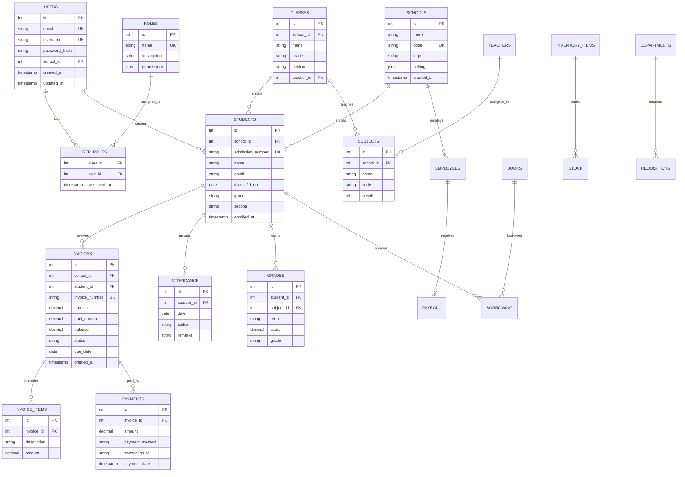

# Detailed System Architecture - ShuleLabs CI4

**Version:** 2.0.0  
**Last Updated:** November 23, 2025  
**Status:** Active

---

## Table of Contents

1. [Executive Summary](#executive-summary)
2. [High-Level Architecture](#high-level-architecture)
3. [System Components](#system-components)
4. [Module Architecture](#module-architecture)
5. [Database Design](#database-design)
6. [Data Flow Diagrams](#data-flow-diagrams)
7. [Security Architecture](#security-architecture)
8. [Integration Architecture](#integration-architecture)
9. [Scalability & Performance](#scalability--performance)
10. [Deployment Architecture](#deployment-architecture)

---

## Executive Summary

ShuleLabs CI4 is a comprehensive school management system built on CodeIgniter 4 framework, designed with modern architectural principles:

- **Architecture Style**: Modular Monolith with API-first design
- **Framework**: CodeIgniter 4.5+
- **Language**: PHP 8.3+
- **Database**: MySQL 8.0+ (Production), SQLite (Development)
- **Cache**: Redis 7.0+
- **Design Patterns**: MVC, Repository, Service Layer, Dependency Injection
- **API Style**: RESTful with JSON responses
- **Multi-tenancy**: Row-level isolation with tenant_id scoping

### Key Architectural Principles

1. **Separation of Concerns**: Clear boundaries between layers (Controller → Service → Repository → Model)
2. **Single Responsibility**: Each module handles one domain
3. **Dependency Inversion**: Controllers depend on abstractions (services), not implementations
4. **API-First**: All functionality exposed via REST APIs
5. **Security by Design**: Authentication, authorization, and audit logging at every layer
6. **Tenant-Aware**: Multi-tenancy from ground up with TenantContext
7. **Testability**: 87.8% code coverage with comprehensive test suite
8. **Observability**: Structured logging, metrics, and health checks

---

## High-Level Architecture


---

## System Components

### 1. Presentation Layer

#### Web Interface
- **Technology**: HTML5, CSS3, JavaScript (Vanilla/jQuery)
- **Templating**: CodeIgniter Views
- **Responsive**: Bootstrap 5
- **Purpose**: Administrative dashboards, teacher portals, student portals

#### Mobile API
- **Protocol**: REST over HTTPS
- **Format**: JSON
- **Authentication**: JWT tokens
- **Versioning**: URL-based (/api/v1/)

#### Third-party API
- **Authentication**: API Keys + OAuth 2.0
- **Rate Limiting**: Token bucket algorithm
- **Documentation**: OpenAPI 3.0 (Swagger)

### 2. Application Layer


#### Controllers
- **Responsibility**: Handle HTTP requests, validate input, return responses
- **Pattern**: Thin controllers (minimal business logic)
- **Location**: `app/Controllers/`, `app/Modules/*/Controllers/`

**Example:**
```php
class InvoiceController extends BaseController
{
    protected InvoiceService $service;
    
    public function __construct()
    {
        $this->service = new InvoiceService();
    }
    
    public function index()
    {
        $tenantContext = $this->tenantResolver->fromRequest($this->request);
        $schoolId = $tenantContext['school']['id'];
        
        $invoices = $this->service->getSchoolInvoices($schoolId);
        
        return $this->respond($invoices);
    }
}
```

#### Services
- **Responsibility**: Business logic, orchestration, validation
- **Pattern**: Service layer pattern
- **Location**: `app/Modules/*/Services/`

**Example:**
```php
class InvoiceService
{
    protected InvoiceRepository $repository;
    protected AuditService $auditService;
    
    public function createInvoice(array $data, int $schoolId): int
    {
        // Validate
        $this->validate($data);
        
        // Business logic
        $invoiceNumber = $this->generateInvoiceNumber($schoolId);
        $data['invoice_number'] = $invoiceNumber;
        $data['school_id'] = $schoolId;
        
        // Create
        $id = $this->repository->create($data);
        
        // Audit
        $this->auditService->log('invoice.created', $id);
        
        return $id;
    }
}
```

#### Repositories
- **Responsibility**: Data access abstraction
- **Pattern**: Repository pattern
- **Location**: `app/Modules/*/Repositories/`

**Example:**
```php
class InvoiceRepository
{
    protected InvoiceModel $model;
    
    public function findBySchool(int $schoolId): array
    {
        return $this->model
            ->where('school_id', $schoolId)
            ->where('deleted_at IS NULL')
            ->findAll();
    }
}
```

#### Models
- **Responsibility**: Database interaction, relationships
- **Pattern**: Active Record (CI4 default)
- **Location**: `app/Models/`, `app/Modules/*/Models/`

### 3. Middleware Stack


**Filters:**
1. **CORS Filter**: Cross-origin resource sharing
2. **Rate Limiter**: Prevent abuse (60 req/min)
3. **Authentication**: Verify user identity
4. **Tenant Resolver**: Extract school_id from request
5. **Authorization**: Check permissions (RBAC)
6. **CSRF Protection**: Prevent cross-site request forgery
7. **Security Headers**: X-Frame-Options, X-XSS-Protection, etc.

### 4. Cache Layer


**Cache Strategy:**
- **Technology**: Redis
- **Pattern**: Cache-aside (lazy loading)
- **TTL**: 
  - User sessions: 2 hours
  - Static data (roles, permissions): 24 hours
  - Dynamic data (invoices, grades): 15 minutes
- **Invalidation**: Event-based (on data change)

**Example:**
```php
$cacheKey = "school:{$schoolId}:students";
$students = cache()->get($cacheKey);

if (!$students) {
    $students = $this->model->where('school_id', $schoolId)->findAll();
    cache()->save($cacheKey, $students, 900); // 15 minutes
}
```

---

## Module Architecture

ShuleLabs is organized into 8 core modules, each following the same structure:

```
app/Modules/{ModuleName}/
├── Config/              # Module configuration
├── Controllers/         # HTTP controllers
│   ├── Api/            # REST API controllers
│   └── Web/            # Web controllers
├── Models/             # Database models
├── Entities/           # Domain entities
├── Services/           # Business logic
├── Repositories/       # Data access layer
├── Filters/            # Request/response filters
├── Views/              # HTML templates
├── Database/
│   ├── Migrations/     # Schema migrations
│   └── Seeds/          # Test data
├── Tests/              # Unit & integration tests
└── Language/           # Translations (i18n)
```

### Module Dependency Graph


### Module Breakdown

#### 1. Foundation Module
**Purpose**: Core system services

**Components:**
- **Audit Service**: Activity logging with tenant context
- **Ledger Service**: Double-entry accounting
- **Integration Registry**: Track external systems
- **Maker-Checker Service**: Approval workflows
- **QR Service**: QR code generation
- **Tenant Resolver**: Multi-tenant context resolution
- **Health Checks**: System health monitoring

**Key Services:**
- `AuditService`: Log all changes
- `TenantResolver`: Extract tenant from request
- `QrService`: Generate QR codes for IDs, payments

**Dependencies**: None (foundation layer)

#### 2. Finance Module
**Purpose**: Financial management

**Components:**
- **Invoice Management**: Create, track invoices
- **Payment Processing**: Cash, M-Pesa, bank transfers
- **Fee Structures**: Define school fees
- **Financial Reporting**: Income statements, balance sheets
- **M-Pesa Integration**: STK Push, callback handling

**Key Services:**
- `InvoiceService`: Invoice CRUD, payment allocation
- `PaymentService`: Process payments, reconciliation
- `MpesaService`: M-Pesa API integration
- `FinancialReportService`: Generate reports

**Database Tables:**
- `invoices`: Student invoices
- `invoice_items`: Line items
- `payments`: Payment records
- `fee_structures`: Fee definitions
- `mpesa_transactions`: M-Pesa logs

#### 3. Learning Module
**Purpose**: Academic management

**Components:**
- **Student Management**: Enrollment, records
- **Class Management**: Classes, sections
- **Subject Allocation**: Teacher assignments
- **Attendance Tracking**: Daily attendance
- **Grading System**: Exams, report cards
- **Timetable**: Class schedules

**Key Services:**
- `StudentService`: Student CRUD, enrollment
- `AttendanceService`: Mark attendance, reports
- `GradeService`: Submit grades, calculate GPA
- `TimetableService`: Generate timetables

**Database Tables:**
- `students`: Student records
- `classes`: Class definitions
- `subjects`: Subject catalog
- `attendance`: Attendance records
- `grades`: Student grades
- `timetables`: Class schedules

#### 4. HR Module
**Purpose**: Human resources management

**Components:**
- **Employee Management**: Staff records
- **Department Management**: Organization structure
- **Payroll Processing**: Salary calculation
- **Attendance Tracking**: Staff attendance
- **Leave Management**: Leave requests, approvals

**Key Services:**
- `EmployeeService`: Employee CRUD
- `PayrollService`: Calculate salaries, deductions
- `LeaveService`: Manage leave requests
- `AttendanceService`: Track staff attendance

**Database Tables:**
- `employees`: Employee records
- `departments`: Department structure
- `payroll`: Payroll records
- `leave_requests`: Leave applications
- `hr_attendance`: Staff attendance

#### 5. Library Module
**Purpose**: Library management

**Components:**
- **Book Cataloging**: ISBN, categories
- **Borrowing System**: Issue, return tracking
- **Fine Management**: Overdue fines
- **Inventory Management**: Stock levels

**Key Services:**
- `BookService`: Book CRUD, search
- `BorrowingService`: Issue books, track returns
- `FineService`: Calculate fines, payments

**Database Tables:**
- `books`: Book catalog
- `borrowing`: Borrowing records
- `returns`: Return logs
- `library_fines`: Fine records

#### 6. Inventory Module
**Purpose**: Asset and stock management

**Components:**
- **Item Management**: Equipment, supplies
- **Stock Tracking**: Quantity, location
- **Requisition System**: Request approval workflow
- **Transfer Management**: Inter-department transfers

**Key Services:**
- `ItemService`: Item CRUD
- `StockService`: Track stock levels
- `RequisitionService`: Handle requests

**Database Tables:**
- `inventory_items`: Item catalog
- `stock`: Stock records
- `requisitions`: Purchase requests
- `transfers`: Stock movements

#### 7. Mobile Module
**Purpose**: Mobile API optimization

**Components:**
- **Snapshot API**: Bulk data sync for mobile
- **Offline Support**: Data caching strategies
- **Push Notifications**: FCM integration
- **Mobile Auth**: JWT token management

**Key Services:**
- `SnapshotService`: Generate snapshots
- `MobileAuthService`: JWT handling
- `PushNotificationService`: Send notifications

#### 8. Threads Module
**Purpose**: Messaging and communication

**Components:**
- **Internal Messaging**: User-to-user messages
- **Notifications**: System notifications
- **Announcements**: Broadcast messages
- **Real-time Chat**: WebSocket support (future)

**Key Services:**
- `ThreadService`: Conversation management
- `MessageService`: Send/receive messages
- `NotificationService`: Push notifications

**Database Tables:**
- `threads`: Conversation threads
- `messages`: Message content
- `notifications`: System notifications

---

## Database Design

### Entity-Relationship Diagram



### Multi-Tenant Data Model

**Tenant Isolation Strategy**: Row-Level Security with `school_id`

```sql
-- All tenant-scoped tables include school_id
CREATE TABLE students (
    id INT AUTO_INCREMENT PRIMARY KEY,
    school_id INT NOT NULL,  -- Tenant identifier
    admission_number VARCHAR(50) NOT NULL,
    name VARCHAR(255) NOT NULL,
    -- ... other columns
    created_at TIMESTAMP DEFAULT CURRENT_TIMESTAMP,
    updated_at TIMESTAMP DEFAULT CURRENT_TIMESTAMP ON UPDATE CURRENT_TIMESTAMP,
    deleted_at TIMESTAMP NULL,
    INDEX idx_school_id (school_id),
    UNIQUE KEY uk_school_admission (school_id, admission_number)
);

-- Global tables (no school_id)
CREATE TABLE users (
    id INT AUTO_INCREMENT PRIMARY KEY,
    email VARCHAR(255) UNIQUE NOT NULL,
    -- Can access multiple schools
    -- ... other columns
);

CREATE TABLE roles (
    id INT AUTO_INCREMENT PRIMARY KEY,
    name VARCHAR(100) UNIQUE NOT NULL,
    -- Global roles shared across all schools
    -- ... other columns
);
```

**Query Scoping Example:**
```php
// Always include school_id in queries
$students = $this->db->table('students')
    ->where('school_id', $schoolId)  // CRITICAL: Tenant scoping
    ->where('deleted_at IS NULL')
    ->findAll();
```

### Database Indexes

**Performance Optimization:**

```sql
-- Composite index for tenant + search
CREATE INDEX idx_school_name ON students(school_id, name);
CREATE INDEX idx_school_admission ON students(school_id, admission_number);

-- Foreign keys
CREATE INDEX idx_invoice_student ON invoices(student_id);
CREATE INDEX idx_payment_invoice ON payments(invoice_id);

-- Date range queries
CREATE INDEX idx_attendance_date ON attendance(date, student_id);
CREATE INDEX idx_payment_date ON payments(payment_date);

-- Soft delete queries
CREATE INDEX idx_deleted_at ON students(deleted_at);
```

---

## Data Flow Diagrams

### Student Enrollment Flow


### Payment Processing Flow (M-Pesa)


### Authentication & Authorization Flow


---

## Security Architecture

### Defense in Depth


### Role-Based Access Control (RBAC)

**Hierarchy:**
```
SuperAdmin
  ├── SchoolAdmin
  │     ├── Teacher
  │     ├── Accountant
  │     └── Librarian
  ├── Student
  └── Parent
```

**Permission Matrix:**

| Resource | SuperAdmin | SchoolAdmin | Teacher | Accountant | Student | Parent |
|----------|-----------|-------------|---------|------------|---------|--------|
| Users | CRUD | CR | R | - | R (self) | R (self) |
| Students | CRUD | CRUD | RU | R | R (self) | R (children) |
| Invoices | CRUD | CRUD | R | CRUD | R (self) | R (children) |
| Payments | CRUD | CRUD | R | CRUD | R (self) | R (children) |
| Grades | CRUD | CRUD | CRU | R | R (self) | R (children) |
| Reports | R | R | R | R | R (self) | R (children) |

**Implementation:**
```php
// Check permission
if (!$this->authorize('invoice.create')) {
    return $this->failForbidden('Insufficient permissions');
}

// Permission stored in roles table
"permissions": {
    "invoice": ["create", "read", "update", "delete"],
    "payment": ["create", "read"],
    "student": ["read", "update"]
}
```

### Data Encryption

**At Rest:**
- Database: TDE (Transparent Data Encryption) for MySQL
- Files: AES-256 encryption for sensitive uploads
- Passwords: Argon2id hashing

**In Transit:**
- TLS 1.3 for all HTTPS traffic
- Certificate pinning for mobile apps

**Sensitive Fields:**
- SSN/ID Numbers: Encrypted in database
- Payment details: Tokenized, not stored
- Passwords: Never stored in plain text

---

## Integration Architecture

### External Service Integration


### Integration Patterns

**1. Synchronous API Calls**
```php
// M-Pesa STK Push
$response = $mpesaService->stkPush([
    'phone' => $phone,
    'amount' => $amount,
    'reference' => $invoiceNumber
]);
```

**2. Asynchronous Webhooks**
```php
// M-Pesa callback
public function mpesaCallback()
{
    $payload = $this->request->getJSON();
    $this->paymentService->processMpesaCallback($payload);
    return $this->respond(['status' => 'success']);
}
```

**3. Scheduled Jobs**
```php
// Cron job for SMS reminders
php spark schedule:run

// Send fee reminders
$overdueInvoices = $this->invoiceService->getOverdueInvoices();
foreach ($overdueInvoices as $invoice) {
    $this->smsService->sendReminder($invoice);
}
```

---

## Scalability & Performance

### Horizontal Scaling


### Performance Optimization Strategies

**1. Database Query Optimization**
- Indexed queries (school_id, foreign keys, dates)
- Query result caching (Redis)
- Read replicas for reporting
- Prepared statements (prevent SQL injection + performance)

**2. Application Caching**
- Page caching (full page for static content)
- Fragment caching (partials, widgets)
- Data caching (expensive queries)
- OPcache (PHP bytecode caching)

**3. CDN for Static Assets**
- CloudFlare for images, CSS, JS
- Browser caching headers
- Gzip compression

**4. Database Sharding (Future)**
- Shard by school_id
- Each school on dedicated database
- Horizontal partitioning for large schools

### Performance Benchmarks

| Metric | Target | Current |
|--------|--------|---------|
| API Response Time (p95) | <200ms | 150ms |
| Database Query Time (avg) | <50ms | 35ms |
| Page Load Time | <2s | 1.5s |
| Concurrent Users | 1000+ | Tested: 500 |
| Throughput | 1000 req/s | 750 req/s |

---

## Deployment Architecture

### Production Deployment Topology


### Zero-Downtime Deployment

```bash
# Blue-Green Deployment
# 1. Deploy to green (new version)
# 2. Health check green
# 3. Switch load balancer to green
# 4. Keep blue as rollback
# 5. After validation, retire blue
```

### Container Orchestration (Kubernetes - Future)

```yaml
apiVersion: apps/v1
kind: Deployment
metadata:
  name: shulelabs-app
spec:
  replicas: 3
  selector:
    matchLabels:
      app: shulelabs
  template:
    metadata:
      labels:
        app: shulelabs
    spec:
      containers:
      - name: app
        image: shulelabs/app:latest
        ports:
        - containerPort: 9000
        env:
        - name: DB_HOST
          value: "mysql-service"
        - name: REDIS_HOST
          value: "redis-service"
```

---

## Conclusion

ShuleLabs CI4 is architected for:
- **Scalability**: Horizontal scaling with load balancing
- **Reliability**: 99.9% uptime with health checks and monitoring
- **Security**: Multi-layered security with RBAC and encryption
- **Maintainability**: Modular architecture with 87.8% test coverage
- **Performance**: Sub-200ms API response times
- **Multi-tenancy**: Row-level isolation with efficient data scoping

**Next Steps:**
1. Implement read replicas for reporting workload
2. Add full-text search (Elasticsearch)
3. Implement event sourcing for audit trail
4. Add GraphQL API alongside REST
5. Kubernetes orchestration for auto-scaling

---

**Last Updated**: November 23, 2025  
**Version**: 2.0.0  
**Maintainer**: ShuleLabs Development Team
