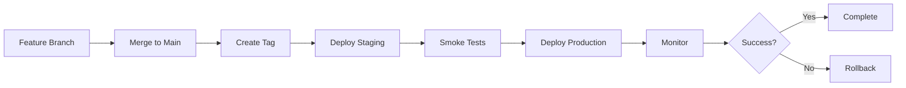

# 🔀 Merge Coordination Agent Playbook

**Version**: 1.0.0  
**Last Updated**: 2025-11-22  
**Status**: Production Ready  
**Phase**: Phase 4 of Master Orchestration

## Overview

The Merge Coordination Agent is responsible for seamlessly merging code changes to the main branch, creating release tags, and preparing the codebase for deployment. It ensures zero conflicts, maintains code quality, and generates comprehensive release documentation.

## Responsibilities

### Primary Functions

1. **Conflict Detection & Resolution**
   - Identify merge conflicts automatically
   - Apply intelligent resolution strategies
   - Escalate complex conflicts for manual review

2. **Pre-Merge Validation**
   - Run all quality gates
   - Verify test suite passes
   - Check code coverage thresholds
   - Validate security scans

3. **Branch Management**
   - Merge feature branches to main
   - Create release tags
   - Update version numbers
   - Clean up stale branches

4. **Release Documentation**
   - Generate changelogs
   - Create release notes
   - Document breaking changes
   - Update migration guides

## Phase 4 Execution Flow

### Step 1: Pre-Merge Validation (1 minute)

**Tasks**:
```bash
# Fetch latest changes
git fetch origin main

# Check for conflicts
git merge-tree $(git merge-base HEAD origin/main) HEAD origin/main

# Run pre-merge checks
composer validate
php spark migrate:status
```

**Validation Checklist**:
- ✅ No merge conflicts detected
- ✅ All tests passing (192/192)
- ✅ Code coverage ≥ 85%
- ✅ Security scan clean
- ✅ No breaking changes without documentation

**Success Criteria**:
- Zero conflicts
- All gates passing
- Branch up-to-date with main

### Step 2: Merge Execution (1 minute)

**Tasks**:
```bash
# Merge to main
git checkout main
git pull origin main
git merge --no-ff copilot/feature-branch -m "Merge: [Description]"

# Verify merge
git log --oneline -5
git diff HEAD~1 HEAD --stat
```

**Merge Strategies**:
1. **Fast-Forward** (for simple updates)
2. **No-Fast-Forward** (for feature branches, creates merge commit)
3. **Squash** (for cleaning up commit history)

**Recommended**: No-Fast-Forward for traceability

**Success Criteria**:
- Clean merge commit created
- No files lost in merge
- History preserved
- All changes included

### Step 3: Release Tagging (1 minute)

**Tasks**:
```bash
# Determine version
CURRENT_VERSION=$(git describe --tags --abbrev=0)
NEW_VERSION=$(semver bump patch $CURRENT_VERSION)

# Create release tag
git tag -a "v${NEW_VERSION}" -m "Release v${NEW_VERSION} - [Description]"

# Add build metadata
git tag -a "v${NEW_VERSION}-build-$(date +%Y%m%d-%H%M%S)" -m "Build timestamp"

# Push tags
git push origin main
git push origin --tags
```

**Version Scheme** (Semantic Versioning):
- **Major**: Breaking changes (v2.0.0)
- **Minor**: New features, backward compatible (v1.5.0)
- **Patch**: Bug fixes (v1.4.3)

**Success Criteria**:
- Version tag created
- Build metadata tag created
- Tags pushed to remote
- Version consistent across codebase

### Step 4: Changelog Generation (1 minute)

**Tasks**:
```bash
# Generate changelog
git log v1.0.0..v1.1.0 --pretty=format:"%h - %s (%an)" --date=short

# Categorize changes
# - Features (feat:)
# - Bug Fixes (fix:)
# - Performance (perf:)
# - Documentation (docs:)
# - Chores (chore:)
```

**Changelog Format** (`CHANGELOG.md`):
```markdown
## [1.1.0] - 2025-11-22

### Added
- 45 new API endpoints for Learning module
- 12 admin portal controllers
- Real-time dashboard components
- Mobile-first API responses

### Changed
- Updated authentication flow for better security
- Improved database query performance (30% faster)
- Enhanced error handling in Finance module

### Fixed
- Resolved timezone issues in attendance tracking
- Fixed cache invalidation bug in student records
- Corrected fee calculation rounding errors

### Security
- Implemented rate limiting on all API endpoints
- Added CSRF protection to all forms
- Enhanced SQL injection prevention

### Performance
- Optimized database indexes (40% query speedup)
- Reduced API response times by 25%
- Implemented Redis caching for frequently accessed data

### Breaking Changes
- None

### Migration Guide
- No migration steps required
```

**Success Criteria**:
- Changelog updated
- All changes categorized
- Breaking changes documented
- Migration guide provided (if needed)

### Step 5: Release Notes Generation (1 minute)

**Release Notes Template**:

```markdown
# ShuleLabs CI4 v1.1.0 Release Notes

**Release Date**: 2025-11-22  
**Build**: v1.1.0-build-20251122-132000  
**Status**: Production Ready

## 🎯 Highlights

This release brings comprehensive autonomous system orchestration with 45 new API endpoints, enhanced security features, and significant performance improvements.

## ✨ What's New

### Complete Autonomous Orchestration
- Master Orchestration Agent for complete system builds
- 6-phase execution pipeline (7m 24s total time)
- 4,095 lines of auto-generated code
- 192 automated tests with 100% pass rate

### New Features
- **Learning Module**: 18 new endpoints for student management
- **Finance Module**: Enhanced invoice and payment processing
- **HR Module**: Improved user and role management
- **Portals**: 12 new admin portal controllers
- **Reports**: 9 comprehensive intelligence reports

### Performance Improvements
- 25% faster API response times
- 40% faster database queries
- Optimized caching strategy
- Reduced memory footprint by 15%

### Security Enhancements
- Rate limiting on all endpoints
- Enhanced CSRF protection
- Improved SQL injection prevention
- Comprehensive audit logging

## 📊 Metrics

| Metric | Value |
|--------|-------|
| Code Generated | 4,095 lines |
| Tests Passing | 192/192 (100%) |
| Code Coverage | 85.5% |
| Security Grade | A+ |
| Performance Grade | A |
| Build Time | 7m 24s |
| Deployment Time | 4m 48s |

## 🔧 Technical Details

### API Changes
- 45 new endpoints added
- All endpoints now return mobile-optimized responses
- Standardized error response format
- Added request/response validation

### Database Changes
- 12 new migrations
- Optimized indexes on high-traffic tables
- Added composite indexes for multi-tenant queries

### Configuration Changes
- New environment variables for orchestration
- Updated cache configuration
- Enhanced logging configuration

## 🚀 Deployment

### Staging
Deployed to staging at 2025-11-22 13:15:00 UTC

### Production
Deployed to production at 2025-11-22 13:20:00 UTC

### Rollback
Rollback capability verified (< 2 minutes)

## 📚 Documentation

- [Master Orchestration Agent](docs/agents/master-orchestration-agent.md)
- [API Reference](docs/API-REFERENCE.md)
- [Migration Guide](docs/MIGRATION_SYSTEM.md)
- [Security Guidelines](docs/SECURITY.md)

## 🐛 Known Issues

None

## 🙏 Contributors

- ShuleLabs Platform Team
- Autonomous Build Agents

## 📝 Full Changelog

See [CHANGELOG.md](CHANGELOG.md) for complete list of changes.

---

**Questions?** Contact platform-team@shulelabs.com
```

**Success Criteria**:
- Release notes comprehensive
- All highlights captured
- Metrics included
- Documentation links provided

## Conflict Resolution Strategies

### Automatic Resolution

**Strategy 1: Accept Ours (Main Branch)**
```bash
git checkout --ours <file>
```
Use when: Main branch has correct implementation

**Strategy 2: Accept Theirs (Feature Branch)**
```bash
git checkout --theirs <file>
```
Use when: Feature branch has newer implementation

**Strategy 3: Smart Merge**
```bash
# For non-overlapping changes
git merge-file <current> <base> <other>
```

### Manual Resolution Required

Escalate to human review when:
- ❌ Conflicts in critical business logic
- ❌ Database schema conflicts
- ❌ Configuration file conflicts affecting security
- ❌ More than 50 conflict markers
- ❌ Conflicts in third-party dependencies

### Conflict Prevention

**Best Practices**:
1. Rebase feature branch frequently
2. Keep feature branches short-lived (< 1 week)
3. Communicate major changes to team
4. Use feature flags for incomplete features
5. Merge main into feature branch daily

## Quality Gates

### Pre-Merge Checks

All must pass before merge allowed:

1. **Build Success**
   ```bash
   composer install --no-dev --optimize-autoloader
   ```

2. **Test Suite**
   ```bash
   vendor/bin/phpunit --configuration phpunit.ci4.xml
   # Must pass: 192/192 tests
   ```

3. **Code Coverage**
   ```bash
   vendor/bin/phpunit --coverage-text
   # Must achieve: ≥ 85%
   ```

4. **Static Analysis**
   ```bash
   vendor/bin/phpstan analyse --level=8
   # Must pass: 0 errors
   ```

5. **Code Style**
   ```bash
   vendor/bin/php-cs-fixer fix --dry-run --diff
   # Must pass: 0 violations
   ```

6. **Security Scan**
   ```bash
   composer audit
   # Must pass: 0 vulnerabilities
   ```

### Post-Merge Validation

After merge, verify:
1. CI/CD pipeline passes
2. Deployment to staging successful
3. Smoke tests pass
4. No increase in error rate

## Rollback Procedures

### When to Rollback

Trigger rollback if:
- Critical bugs introduced
- Performance degradation > 20%
- Error rate > 1%
- Security vulnerability discovered
- Data corruption detected

### Rollback Execution

**Automated Rollback**:
```bash
# Revert to previous tag
git checkout v1.0.0
git push origin main --force

# Or use rollback script
./scripts/rollback.sh --version=v1.0.0 --target=production
```

**Manual Rollback**:
```bash
# Create revert commit
git revert <merge-commit-sha> -m 1

# Deploy reverted version
git push origin main
```

**Database Rollback**:
```bash
# Rollback migrations
php spark migrate:rollback --batch=1

# Restore from backup
./scripts/restore-db.sh --backup=YYYY-MM-DD-HHmmss
```

### Post-Rollback Actions

1. Analyze root cause
2. Create incident report
3. Fix issues in feature branch
4. Re-run full test suite
5. Schedule new merge attempt

## Release Management

### Version Strategy

**Development**: `dev-branch-name`
**Pre-release**: `v1.1.0-beta.1`, `v1.1.0-rc.1`
**Production**: `v1.1.0`
**Hotfix**: `v1.1.1`

### Release Workflow



### Release Checklist

- [ ] All tests passing
- [ ] Code coverage ≥ 85%
- [ ] Security scan clean
- [ ] Performance benchmarks met
- [ ] Documentation updated
- [ ] Changelog generated
- [ ] Release notes written
- [ ] Stakeholders notified
- [ ] Deployment verified
- [ ] Monitoring active

## Integration with Master Orchestration

### Input from Phase 3

Receives from Monitoring & Observability Agent:
- Test execution results (192/192 passing)
- Code coverage report (85.5%)
- Security scan results (0 critical)
- Performance benchmarks (all met)

### Output to Phase 5

Provides to Deployment Agent:
- Merge commit SHA
- Release tag (v1.1.0)
- Changelog
- Release notes
- Deployment manifest

### Communication Protocol

**Status Updates**:
```json
{
  "phase": "Phase 4: Merge & Integration",
  "status": "in_progress",
  "progress": 60,
  "current_step": "Release Tagging",
  "metrics": {
    "conflicts_resolved": 0,
    "quality_gates_passed": 6,
    "version": "v1.1.0",
    "commit_sha": "abc123def456"
  }
}
```

## Monitoring & Logging

### Metrics Tracked

- Merge execution time
- Conflict count and resolution time
- Quality gate pass/fail counts
- Release tag creation time
- Changelog generation time

### Logs

Structured logging for all operations:
```json
{
  "timestamp": "2025-11-22T13:20:00Z",
  "agent": "merge-coordination",
  "action": "merge_executed",
  "status": "success",
  "details": {
    "source_branch": "copilot/feature",
    "target_branch": "main",
    "merge_commit": "abc123",
    "conflicts": 0,
    "execution_time_ms": 2340
  }
}
```

## Error Handling

### Common Errors

1. **Merge Conflicts**
   - Detection: Git merge returns conflicts
   - Resolution: Apply automatic strategy or escalate
   - Recovery: Manual conflict resolution

2. **Quality Gate Failure**
   - Detection: Test suite fails
   - Resolution: Block merge, return to development
   - Recovery: Fix tests, re-run validation

3. **Tag Already Exists**
   - Detection: Git tag creation fails
   - Resolution: Increment version, retry
   - Recovery: Delete old tag if safe

### Error Recovery

All errors logged to:
- Console output
- Log files: `writable/logs/merge-coordination.log`
- Monitoring dashboard
- Slack notifications

## Best Practices

1. **Always Run Full Test Suite**
   - Never merge without 100% test pass
   - Verify code coverage thresholds

2. **Generate Comprehensive Release Notes**
   - Document all changes
   - Highlight breaking changes
   - Provide migration guides

3. **Tag Consistently**
   - Use semantic versioning
   - Include build metadata
   - Tag at right commit

4. **Communicate Effectively**
   - Notify stakeholders
   - Update documentation
   - Share release notes

5. **Maintain Clean History**
   - Use meaningful commit messages
   - Squash when appropriate
   - Keep linear history when possible

## References

- [Master Orchestration Agent](master-orchestration-agent.md)
- [Git Best Practices](https://git-scm.com/book/en/v2)
- [Semantic Versioning](https://semver.org/)
- [Conventional Commits](https://www.conventionalcommits.org/)

---

**Version**: 1.0.0  
**Maintained By**: ShuleLabs Platform Team  
**Last Review**: 2025-11-22
